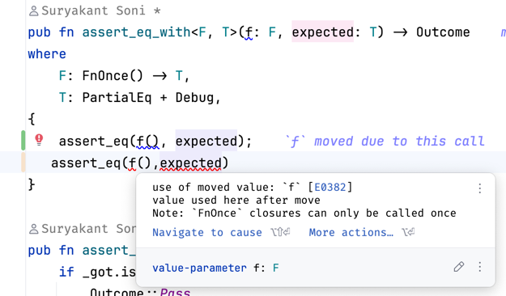

// Provided by test-runner lib:
Outcome = Pass | Fail(&'static str) | Error(&'static str)
Logger = trait { log(&mut self, s: &str) }
TestCase = { name: &'static str, f: fn(&mut dyn Logger) -> Outcome }
RegistryN = fixed-size array of Option<TestCase>; register(); run_all()

// App writes:
fn my_test(log: &mut dyn Logger) -> Outcome {
// use assert_eq/assert_ne/assert_true/assert_false/...
assert_eq(some_app_fn(), 42)
}

// Harness wires:
REG.register(TestCase{name: "my_test", f: my_test});
REG.run_all(&mut logger);

Insights from project -

1. `static mut` is unsafe, it need unsafe block. since rust rules doesnt allow more than one mutable references of any
   object at a time.since compiler restriction
   are not possible in unsafe, it can have possible bugs.
2. `StaticCell` ensures rust rules and unsafe block is not needed. its initialization is via init method which cannot be
   called again, you use .get and .get_mut for getting references,
   you cannot call .get_mut again if the first object is alive in the scope
3. using a declarative macro to easily register a new test case - test_case!
4. kept attributes as private for Registry main object and test case object as well, using apis for construction and get
   attribute calls.
5. using generics with function assert_eq_with where the function passed inside assert api is bound with FnOnce trait,
   i.e. it can be called only once in function assert_eq_with after which the closure instance is
   consumed and gives compiletime error when tried recalling as can be seen in the below image
   
6. you can use `cargo run --example quickstart` and create sample main process for running examples using library code.
7. you can use parameter in Enums! when you return an enum value, you can also return a paramter with that enum value
   like below
   `pub enum Outcome {
       Pass,
       Fail(&'static str),
       Error(&'static str),
   }` fail and error enum values can also show messages.
8. this is how you can ensure that standard library code is not linked to the binary and putting a condition that a
   particular feature `std` should not be active
   `#![cfg_attr(not(feature = "std"), no_std)]`